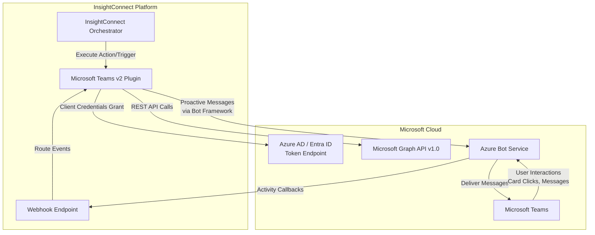
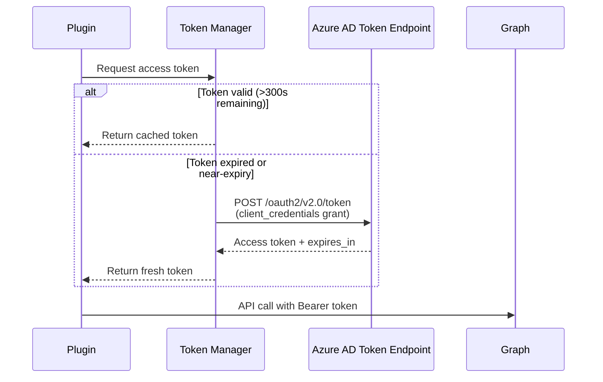
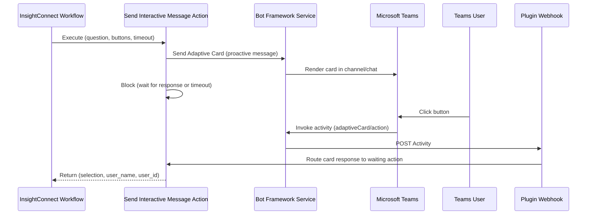
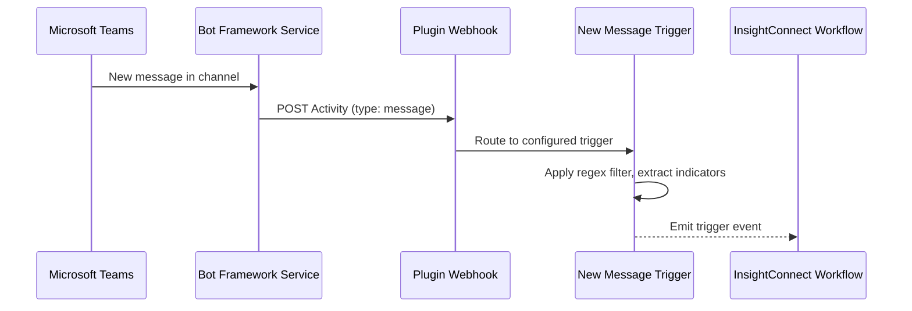
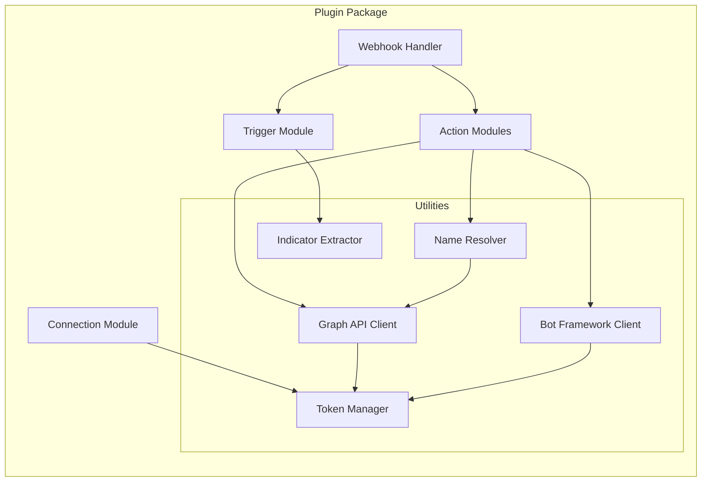

# Design Document: Microsoft Teams v2 Bot Plugin

## Overview

The Microsoft Teams v2 plugin is a complete rewrite of the existing v1 plugin, replacing user-delegated OAuth (ROPC grant with username/password) with Azure Bot Service application-identity authentication (client credentials grant). This eliminates MFA friction, per-user license costs, and credential rotation issues.

The plugin communicates with Microsoft Teams through two complementary protocols:
1. **Microsoft Graph API v1.0** — for team/channel/membership CRUD operations and message retrieval
2. **Bot Framework** — for sending proactive messages and receiving interactive card responses via webhook

The architecture introduces a webhook endpoint to receive Bot Framework Activity callbacks, enabling a new interactive messaging capability (Adaptive Cards with buttons) that blocks until a user responds or a timeout expires.

### Key Design Decisions

| Decision | Rationale |
|----------|-----------|
| Client credentials grant (no user delegation) | Eliminates MFA, per-user licensing, and password rotation |
| Graph API v1.0 (not beta) | Stable, production-supported endpoints |
| Bot Framework for messaging | Required for proactive messaging and Adaptive Card interactions |
| Single webhook endpoint for all callbacks | Simplifies deployment; routes by Activity type internally |
| Token refresh at 300s before expiry | Prevents mid-request token expiration without excessive refresh calls |
| Environment-aware endpoint resolution | Supports commercial, GCC, GCC High, and DoD tenants |

## Architecture

### System Context Diagram



### Authentication Flow



### Interactive Message Flow (Adaptive Cards)



### New Message Trigger Flow (Webhook-Based)



## Components and Interfaces

### Component Overview



### Component Descriptions

#### 1. Connection Module (`connection/connection.py`)

**Responsibility:** Store connection parameters, initialize the Token Manager, validate credentials on `test()`.

**Inputs:** application_id, directory_id (tenant), bot_id, client_secret, endpoint_environment  
**Outputs:** Authenticated client instances (GraphClient, BotClient)

Key differences from v1:
- No `username_password` credential — purely application identity
- Adds `bot_id` input for Bot Framework operations
- Uses OAuth 2.0 client credentials grant (`grant_type=client_credentials`) with `scope=https://graph.microsoft.com/.default`
- `connect()` stores parameters and initializes clients — no API calls
- `test()` requests a token and verifies it succeeds

#### 2. Token Manager (`util/token_manager.py`)

**Responsibility:** Manage OAuth 2.0 access token lifecycle with proactive refresh.

**Interface:**
```python
class TokenManager:
    def __init__(self, app_id: str, app_secret: str, tenant_id: str, endpoint: str, logger: Logger)
    def get_token(self) -> str  # Returns valid token, refreshing if within 300s of expiry
    def _request_token(self) -> None  # Performs client_credentials grant
```

**Behavior:**
- Caches token and `expires_at` timestamp
- `get_token()` checks if `time.time() >= expires_at - 300`; if so, calls `_request_token()`
- Token endpoint URLs resolved from environment map
- Raises `ConnectionTestException` on auth failure with HTTP status and error description

#### 3. Graph API Client (`util/graph_client.py`)

**Responsibility:** Centralized HTTP client for all Microsoft Graph API v1.0 operations.

**Interface:**
```python
class GraphClient:
    def __init__(self, token_manager: TokenManager, resource_url: str, tenant_id: str, logger: Logger)
    
    # Teams
    def list_teams(self, name_filter: str = None) -> list[dict]
    def get_team_by_name(self, team_name: str) -> dict
    def delete_group(self, group_id: str) -> bool
    def create_group(self, name: str, description: str, mail_nickname: str, mail_enabled: bool, owners: list, members: list) -> dict
    
    # Channels
    def list_channels(self, team_id: str, name_filter: str = None) -> list[dict]
    def create_channel(self, team_id: str, name: str, description: str, channel_type: str) -> bool
    def delete_channel(self, team_id: str, channel_id: str) -> bool
    
    # Members
    def add_member_to_team(self, team_id: str, user_id: str) -> bool
    def remove_member_from_team(self, team_id: str, user_id: str) -> bool
    def add_owner_to_group(self, group_id: str, user_id: str) -> bool
    def add_member_to_channel(self, team_id: str, channel_id: str, user_id: str, role: str) -> bool
    
    # Users
    def resolve_user_by_email(self, email: str) -> dict
    
    # Messages
    def get_channel_message(self, team_id: str, channel_id: str, message_id: str, reply_id: str = None) -> dict
    def get_chat_message(self, chat_id: str, message_id: str) -> dict
    def list_message_replies(self, team_id: str, channel_id: str, message_id: str) -> list[dict]
    def list_chat_messages(self, chat_id: str, top: int = 50) -> list[dict]
    
    # Chats
    def create_chat(self, members: list[dict], topic: str = None) -> dict
    
    # Internal
    def _make_request(self, method: str, endpoint: str, **kwargs) -> Union[dict, list]
    def _handle_status(self, response: requests.Response) -> None
```

**Design notes:**
- Uses `requests.Session` with `Authorization` header set per-request via `TokenManager.get_token()`
- All endpoints use Graph API v1.0 (not beta)
- Pagination handled internally via `@odata.nextLink`
- `_handle_status()` maps HTTP codes to `PluginException` with specific cause/assistance per status

#### 4. Bot Framework Client (`util/bot_client.py`)

**Responsibility:** Send proactive messages (plain text, HTML, Adaptive Cards) via Bot Framework.

**Interface:**
```python
class BotClient:
    def __init__(self, token_manager: TokenManager, bot_id: str, service_url: str, logger: Logger)
    
    def send_to_channel(self, team_id: str, channel_id: str, content: str, content_type: str = "text", thread_id: str = None) -> dict
    def send_to_chat(self, chat_id: str, content: str, content_type: str = "text") -> dict
    def send_adaptive_card(self, conversation_id: str, card_payload: dict) -> dict
```

**Design notes:**
- Constructs Bot Framework conversation references from team/channel/chat IDs
- Uses the Bot Framework REST API to send activities
- The service URL is obtained from the Azure Bot registration configuration
- For Adaptive Cards, constructs the card JSON payload with Action.Execute buttons

#### 5. Webhook Handler (`util/webhook_handler.py`)

**Responsibility:** Receive and route incoming Bot Framework Activity callbacks.

**Interface:**
```python
class WebhookHandler:
    def __init__(self, logger: Logger)
    
    def handle_activity(self, activity: dict) -> dict  # Returns HTTP response body
    def register_card_waiter(self, card_id: str, callback: Callable) -> None
    def register_message_trigger(self, channel_id: str, callback: Callable) -> None
    def validate_auth_token(self, auth_header: str) -> bool
```

**Behavior:**
- Validates Bot Connector authentication token on every request (JWT validation against Microsoft's OpenID metadata)
- Routes `invoke` activities (adaptiveCard/action) to waiting interactive message actions
- Routes `message` activities to registered new message triggers
- Returns HTTP 200 for all valid activities (even unmatched ones)
- Returns HTTP 401 for invalid/missing auth tokens

#### 6. Name Resolver (`util/name_resolver.py`)

**Responsibility:** Resolve human-readable team/channel names to Graph API IDs.

**Interface:**
```python
class NameResolver:
    def __init__(self, graph_client: GraphClient, logger: Logger)
    
    def resolve_team(self, team_name: str) -> str  # Returns team_id
    def resolve_channel(self, team_id: str, channel_name: str) -> str  # Returns channel_id
    def resolve_user(self, email: str) -> str  # Returns user_id
```

#### 7. Indicator Extractor (`util/indicator_extractor.py`)

**Responsibility:** Extract security indicators (IOCs) from message body text.

**Interface:**
```python
class IndicatorExtractor:
    @staticmethod
    def extract_all(message_body: str) -> dict  # Returns indicators dict
```

**Extracts:** domains, URLs, email addresses, IPv4, IPv6, MD5, SHA1, SHA256, MAC addresses, CVEs, UUIDs — each as a deduplicated list.

### Action Modules

| Action | Graph/Bot | Key Operations |
|--------|-----------|----------------|
| Send Message | Bot Framework | Send plain text to channel or chat, optional thread reply |
| Send HTML Message | Bot Framework | Send HTML content to channel or chat, optional thread reply |
| Send Message by GUID | Bot Framework | Send to channel by GUID (skip name resolution) |
| Send Interactive Message | Bot Framework + Webhook | Send Adaptive Card, block for response |
| Get Teams | Graph API | List teams with optional regex filter |
| Get Channels for Team | Graph API | List channels with optional regex filter |
| Add Member to Team | Graph API | Resolve user + team, add membership |
| Remove Member from Team | Graph API | Resolve user + team, remove membership |
| Add Channel to Team | Graph API | Create Standard or Private channel |
| Remove Channel from Team | Graph API | Delete channel (prevent General deletion) |
| Create Teams-Enabled Group | Graph API | Create M365 group with Teams provisioning |
| Delete Team | Graph API | Delete M365 group (deletes team) |
| Add Group Owner | Graph API | Add user as group owner |
| Add Member to Channel | Graph API | Add user to private channel with role |
| Get Message in Channel | Graph API | Retrieve message by IDs |
| Get Message in Chat | Graph API | Retrieve chat message by IDs |
| Get Reply List | Graph API | List replies to a channel message |
| List Messages in Chat | Graph API | List last 50 chat messages |
| Create Teams Chat | Graph API | Create oneOnOne or group chat |

## Data Models

### Connection Input Schema

```yaml
connection:
  application_id:
    title: Application ID
    description: Application (client) ID from Azure Bot registration
    type: string
    required: true
  directory_id:
    title: Directory ID
    description: Directory (tenant) ID
    type: string
    required: true
  bot_id:
    title: Bot ID
    description: Bot ID from Azure Bot Service registration
    type: string
    required: true
  application_secret:
    title: Application Secret
    description: Client secret from Azure Bot registration
    type: credential_secret_key
    required: true
  endpoint:
    title: Endpoint Environment
    description: The cloud environment to connect to
    type: string
    required: true
    default: Normal
    enum:
      - Normal
      - GCC
      - GCC High
      - DoD
```

### Environment Endpoint Map

| Environment | Login URL | Graph Resource URL |
|-------------|-----------|-------------------|
| Normal | `https://login.microsoftonline.com` | `https://graph.microsoft.com` |
| GCC | `https://login.microsoftonline.com` | `https://graph.microsoft.com` |
| GCC High | `https://login.microsoftonline.us` | `https://graph.microsoft.us` |
| DoD | `https://login.microsoftonline.us` | `https://dod-graph.microsoft.us` |

### Custom Types

#### team
```yaml
team:
  displayName: { type: string }
  id: { type: string }
  description: { type: string }
```

#### channel
```yaml
channel:
  displayName: { type: string }
  id: { type: string }
  description: { type: string }
```

#### chatMessage
```yaml
chatMessage:
  id: { type: string }
  body: { type: itemBody }
  from: { type: from }
  createdDateTime: { type: string }
  lastModifiedDateTime: { type: string }
  webUrl: { type: string }
  attachments: { type: "[]object" }
  mentions: { type: "[]object" }
  reactions: { type: "[]chatMessageReaction" }
  importance: { type: string }
  messageType: { type: string }
  locale: { type: string }
  channelIdentity: { type: channelIdentity }
```

#### itemBody
```yaml
itemBody:
  content: { type: string }
  contentType: { type: string }  # "text" or "html"
```

#### indicators
```yaml
indicators:
  domains: { type: "[]string" }
  urls: { type: "[]string" }
  email_addresses: { type: "[]string" }
  hashes: { type: hashes }
  ip_addresses: { type: ip_addresses }
  mac_addresses: { type: "[]string" }
  cves: { type: "[]string" }
  uuids: { type: "[]string" }
```

#### group
```yaml
group:
  id: { type: string }
  displayName: { type: string }
  mail: { type: string }
  mailNickname: { type: string }
  description: { type: string }
  createdDateTime: { type: string }
  mailEnabled: { type: boolean }
  securityEnabled: { type: boolean }
```

#### interactiveMessageResponse
```yaml
interactiveMessageResponse:
  answer: { type: string }          # Selected button label
  user_name: { type: string }       # Responding user's display name
  user_id: { type: string }         # Responding user's ID
  timed_out: { type: boolean }      # True if timeout expired
```

### Adaptive Card Payload Structure

```json
{
  "type": "AdaptiveCard",
  "$schema": "http://adaptivecards.io/schemas/adaptive-card.json",
  "version": "1.4",
  "body": [
    {
      "type": "TextBlock",
      "text": "{header}",
      "weight": "Bolder",
      "size": "Medium"
    },
    {
      "type": "TextBlock",
      "text": "{body_text}",
      "wrap": true
    },
    {
      "type": "TextBlock",
      "text": "{question}",
      "wrap": true,
      "weight": "Bolder"
    }
  ],
  "actions": [
    {
      "type": "Action.Execute",
      "title": "{button_label_1}",
      "data": {
        "card_id": "{unique_card_id}",
        "selection": "{button_label_1}"
      }
    }
  ]
}
```

### Token Request/Response

**Request (Client Credentials Grant):**
```
POST https://login.microsoftonline.com/{tenant_id}/oauth2/v2.0/token
Content-Type: application/x-www-form-urlencoded

client_id={app_id}
&client_secret={app_secret}
&scope=https://graph.microsoft.com/.default
&grant_type=client_credentials
```

**Response:**
```json
{
  "token_type": "Bearer",
  "expires_in": 3599,
  "access_token": "eyJ0eXAi..."
}
```

### Required Application Permissions

| Permission | Purpose | Actions |
|-----------|---------|---------|
| ChannelMessage.Send | Send messages to channels | Send Message, Send HTML Message, Send Message by GUID, Send Interactive Message |
| ChatMessage.Send | Send messages to chats | Send Message, Send HTML Message |
| Chat.ReadWrite.All | Create and read chats | Create Teams Chat, List Messages in Chat, Get Message in Chat |
| Team.ReadBasic.All | List and read teams | Get Teams, all actions requiring team name resolution |
| Channel.ReadBasic.All | List and read channels | Get Channels, all actions requiring channel name resolution |
| Channel.Create | Create channels | Add Channel to Team |
| Channel.Delete.All | Delete channels | Remove Channel from Team |
| TeamMember.ReadWrite.All | Manage team members | Add Member to Team, Remove Member from Team |
| ChannelMember.ReadWrite.All | Manage channel members | Add Member to Channel |
| Group.ReadWrite.All | Create/delete groups, manage owners | Create Teams-Enabled Group, Delete Team, Add Group Owner |

## Correctness Properties

*A property is a characteristic or behavior that should hold true across all valid executions of a system — essentially, a formal statement about what the system should do. Properties serve as the bridge between human-readable specifications and machine-verifiable correctness guarantees.*

### Property 1: Token refresh decision boundary

*For any* pair of (current_time, token_expires_at) timestamps, the Token Manager SHALL request a new token if and only if `token_expires_at - current_time <= 300`. When the difference is greater than 300, the cached token SHALL be returned without a network call.

**Validates: Requirements 1.7**

### Property 2: Error responses include identifying context

*For any* HTTP error response from the Graph API or token endpoint that includes a status code and error description, the resulting PluginException or ConnectionTestException SHALL contain both the HTTP status code and the error description text from the response body.

**Validates: Requirements 1.5, 2.6, 3.5, 5.5**

### Property 3: Content type flag controls message payload

*For any* message content string and boolean is_html flag, the constructed request payload SHALL have `contentType` set to `"html"` when is_html is true, and `"text"` when is_html is false or omitted.

**Validates: Requirements 5.2**

### Property 4: Adaptive Card payload structure matches inputs

*For any* question string and list of 2 to 10 button label strings, the generated Adaptive Card JSON SHALL contain exactly one TextBlock with the question text and exactly N Action.Execute elements where N equals the number of button labels, with each action's title matching the corresponding label.

**Validates: Requirements 6.1**

### Property 5: Timeout range validation

*For any* integer timeout value, the interactive message action SHALL accept the value if and only if it is within the range [30, 3600] inclusive. Values outside this range SHALL cause a PluginException to be raised.

**Validates: Requirements 6.2**

### Property 6: Button label count validation

*For any* list of button label strings, the interactive message action SHALL accept the list if and only if its length is within the range [2, 10] inclusive. Lists with fewer than 2 or more than 10 items SHALL cause a PluginException to be raised.

**Validates: Requirements 6.7**

### Property 7: Regex name filter returns first matching resource

*For any* list of resource objects (teams or channels) with display names and any valid regex pattern, the filter function SHALL return the first resource whose display name contains a substring match for the pattern. If no resource matches, a PluginException SHALL be raised.

**Validates: Requirements 7.2, 7.3, 8.2, 8.4**

### Property 8: Invalid regex pattern raises PluginException

*For any* string that is not a valid Python regular expression (e.g., unbalanced brackets, invalid escape sequences), passing it as a name filter or message content filter SHALL raise a PluginException indicating the pattern is invalid.

**Validates: Requirements 7.4, 8.5, 22.3**

### Property 9: Chat type and topic determination

*For any* list of 2 to 250 member objects and any optional topic string, the create chat logic SHALL set chatType to "oneOnOne" when the member count is exactly 2 and "group" when the member count is 3 or more. The topic SHALL be included in the request payload if and only if the chatType is "group".

**Validates: Requirements 21.1, 21.2, 21.5**

### Property 10: Message content regex filtering

*For any* message body string (with HTML tags stripped to plain text) and any valid regex pattern, the trigger SHALL emit an event if and only if the plain-text content contains a substring match for the pattern.

**Validates: Requirements 22.2**

### Property 11: Security indicator extraction completeness

*For any* message body string containing embedded IOC patterns (IPv4 addresses, IPv6 addresses, MD5 hashes, SHA1 hashes, SHA256 hashes, URLs, domains, email addresses, MAC addresses, CVEs, UUIDs), the indicator extractor SHALL return each IOC in its corresponding output list, and each list SHALL contain no duplicate entries.

**Validates: Requirements 22.4**

### Property 12: Word extraction from message body

*For any* message body string, after stripping HTML tags, the first_word output SHALL equal the first whitespace-delimited token of the stripped text (or empty string if no tokens exist), and the words output SHALL equal the complete list of whitespace-delimited tokens in order.

**Validates: Requirements 22.6**

## Error Handling

### Error Classification Strategy

The plugin uses a layered error handling approach:

| Layer | Exception Type | When |
|-------|---------------|------|
| Connection | `ConnectionTestException` | Token request failures (auth errors, network errors) |
| Action/Trigger | `PluginException` | All operational errors (API errors, validation, not found) |
| Webhook | HTTP 401 | Invalid/missing Bot Framework auth token |

### HTTP Status Code Mapping

```python
HTTP_ERROR_MAP = {
    400: {"cause": "Bad request", "assistance": "The request was malformed. Check input parameters."},
    401: {"cause": "Unauthorized", "assistance": "The access token is invalid or expired. Check connection credentials."},
    403: {"cause": "Forbidden", "assistance": "The application lacks the required permission: {permission_name}. Grant the permission in Azure AD and provide admin consent."},
    404: {"cause": "Resource not found", "assistance": "The specified {resource_type} was not found: {resource_id}"},
    409: {"cause": "Conflict", "assistance": "A resource with the same identifier already exists."},
    429: {"cause": "Rate limited", "assistance": "Too many requests. The plugin will retry after the Retry-After period."},
    500: {"cause": "Internal server error", "assistance": "Microsoft Graph returned an internal error. Retry the operation."},
    503: {"cause": "Service unavailable", "assistance": "Microsoft Graph is temporarily unavailable. Retry after a brief delay."},
}
```

### Retry Strategy

- **Token refresh on 401:** If a Graph API call returns 401, refresh the token once and retry. If the retry also fails, raise PluginException.
- **Rate limiting (429):** Respect the `Retry-After` header. Wait the specified duration and retry once.
- **No retry for 4xx (except 401, 429):** Client errors indicate invalid input; retrying won't help.
- **No automatic retry for 5xx:** Surface the error to the workflow author for investigation.

### Input Validation Errors

| Validation | Error Message |
|-----------|---------------|
| Empty message destination | "A message destination is required. Provide either team_name and channel_name, or a chat_id." |
| Button count < 2 or > 10 | "Button label count {n} is outside the allowed range [2, 10]." |
| Timeout < 30 or > 3600 | "Timeout value {n} is outside the allowed range [30, 3600] seconds." |
| Invalid regex pattern | "The provided pattern '{pattern}' is not a valid regular expression: {error}" |
| Message exceeds size limit | "Message body exceeds the maximum allowed size of {limit}." |
| Channel name > 50 chars | "Channel name exceeds the maximum length of 50 characters." |

## Testing Strategy

### Unit Tests (Example-Based)

Unit tests verify specific scenarios, edge cases, and error conditions:

- **Connection tests:** Verify token request construction, environment URL mapping, error handling for auth failures
- **Action tests:** Mock `GraphClient` and `BotClient` methods, verify action logic (input validation, output mapping, error propagation)
- **Webhook tests:** Mock incoming Activity payloads, verify routing logic and auth validation
- **Trigger tests:** Mock message activities, verify regex filtering and indicator extraction

Each action/trigger gets its own test file. Mock at the client helper level (not raw HTTP) to test action logic in isolation.

### Property-Based Tests

Property-based tests verify universal properties across randomized inputs using the `hypothesis` library (Python).

**Configuration:**
- Minimum 100 iterations per property test
- Each test references its design document property via tag comment

**Properties to implement:**

| Property | Test Focus | Generator Strategy |
|----------|-----------|-------------------|
| 1: Token refresh boundary | TokenManager.get_token() | Random (current_time, expires_at) pairs |
| 2: Error context inclusion | _handle_status() | Random HTTP status codes + error bodies |
| 3: Content type flag | Message payload construction | Random (content, is_html) pairs |
| 4: Adaptive Card structure | Card builder function | Random (question, labels[2..10]) |
| 5: Timeout validation | Input validator | Random integers |
| 6: Button count validation | Input validator | Random string lists of varying length |
| 7: Regex name filter | Name resolution filter | Random (names[], pattern) pairs |
| 8: Invalid regex detection | Regex compilation check | Strings with unbalanced brackets |
| 9: Chat type determination | Create chat logic | Random member lists (2-250) + optional topic |
| 10: Regex message filtering | Trigger filter logic | Random (text, pattern) pairs |
| 11: Indicator extraction | IndicatorExtractor.extract_all() | Random text with embedded IOC patterns |
| 12: Word extraction | Word parsing utility | Random HTML strings |

**Tag format:** `# Feature: microsoft-teams-v2-bot-plugin, Property {N}: {title}`

### Integration Tests

Integration tests verify end-to-end behavior with mocked external services:

- **Graph API integration:** Full request/response cycle with realistic payloads
- **Bot Framework integration:** Proactive message sending and Activity callback handling
- **Webhook authentication:** JWT token validation against mocked OpenID metadata

### Test Coverage Target

- Minimum 80% code coverage on all new/modified code
- 100% coverage on input validation and error handling paths
- All 12 correctness properties implemented as property-based tests with ≥100 iterations each

