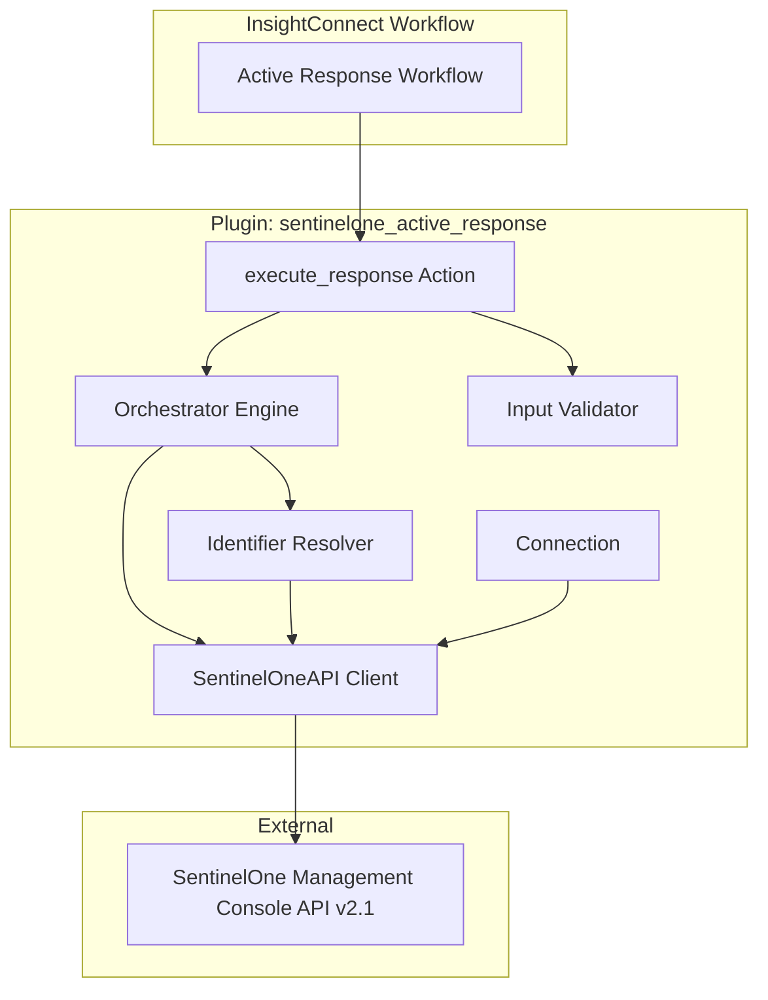
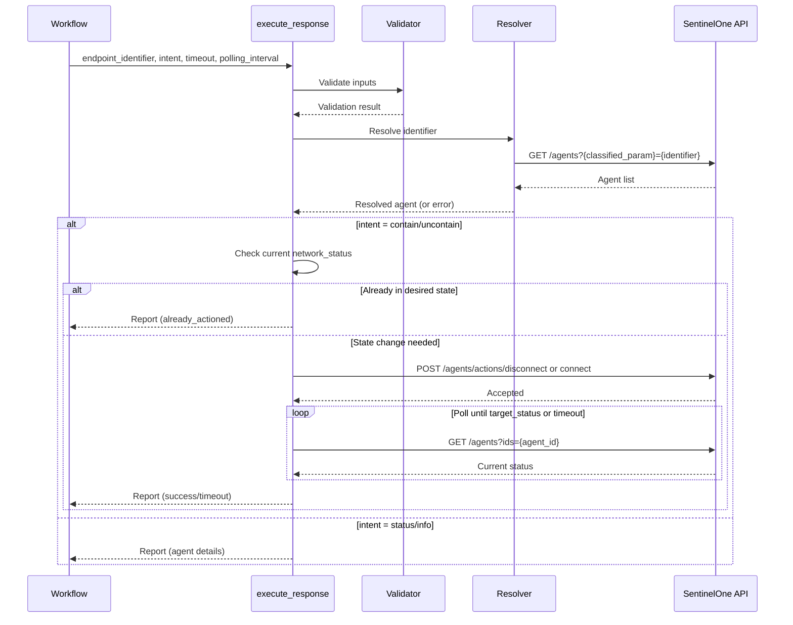

# Design Document: SentinelOne Active Response Plugin

## Overview

The SentinelOne Active Response plugin exposes a single autonomous orchestrator action (`execute_response`) that handles the complete endpoint response lifecycle internally. An analyst provides an endpoint identifier and an intent (contain, uncontain, status, info), and the action autonomously resolves the endpoint, validates state, executes the operation, monitors for confirmation, and returns a comprehensive report.

This "single action orchestrator" pattern eliminates multi-step workflow chaining. The action internally manages the phases: resolve endpoint → validate state → execute operation → monitor → report. Internal polling is appropriate here because this is an orchestrator pattern (not pagination).

### Design Decisions

- **Single action, not five**: One `execute_response` action replaces separate get/contain/uncontain/monitor/report actions. The workflow author sends one intent and gets a complete report back. This drastically simplifies workflow design.
- **Separate plugin from existing `sentinelone` plugin**: The existing SentinelOne plugin has 30+ general-purpose actions. This plugin is purpose-built for active response with a focused interface and built-in orchestration logic.
- **Internal polling**: The action polls for state confirmation internally. This is allowed since it's a bounded orchestrator pattern with configurable timeout (not unbounded pagination).
- **Idempotent operations**: If an endpoint is already in the desired state, the action returns success with `already_actioned` status rather than making a redundant API call.
- **Identifier auto-classification**: The action classifies the input identifier (IP/MAC/hostname/agent_id) and queries the appropriate SentinelOne API parameter, so analysts don't need to know the agent ID.

## Architecture



### Internal Orchestration Flow



### Plugin Directory Structure

```
plugins/sentinelone_active_response/
├── plugin.spec.yaml
├── Dockerfile
├── Makefile
├── requirements.txt
├── setup.py
├── help.md
├── icon.png
├── extension.png
├── bin/
│   └── icon_sentinelone_active_response
├── icon_sentinelone_active_response/
│   ├── __init__.py
│   ├── connection/
│   │   ├── __init__.py
│   │   ├── connection.py
│   │   └── schema.py
│   ├── actions/
│   │   ├── __init__.py
│   │   └── execute_response/
│   │       ├── __init__.py
│   │       ├── action.py
│   │       └── schema.py
│   └── util/
│       ├── __init__.py
│       ├── api.py
│       ├── endpoints.py
│       ├── orchestrator.py
│       ├── resolver.py
│       ├── validators.py
│       └── constants.py
└── unit_test/
    ├── __init__.py
    ├── util.py
    ├── responses/
    ├── test_execute_response.py
    ├── test_orchestrator.py
    ├── test_resolver.py
    ├── test_validators.py
    └── test_api_client.py
```

## Components and Interfaces

### Connection

```python
class Connection(insightconnect_plugin_runtime.Connection):
    """
    Manages SentinelOne API authentication.
    connect(): Instantiates SentinelOneAPI client - no API calls.
    test(): Validates credentials via GET /web/api/v2.1/users/viewer-auth-check
    """
```

**Connection Inputs (plugin.spec.yaml):**
| Field | Type | Required | Description |
|-------|------|----------|-------------|
| instance | string | Yes | SentinelOne instance subdomain (e.g., `usea1-partners`) |
| api_key | credential_secret_key | Yes | SentinelOne API token |

The connection constructs the base URL as `https://{instance}.sentinelone.net` and passes it along with the API key to the `SentinelOneAPI` client.

### Action: execute_response

The single orchestrator action. Accepts an identifier and intent, returns a comprehensive report.

**Inputs:**
| Field | Type | Required | Default | Description |
|-------|------|----------|---------|-------------|
| endpoint_identifier | string | Yes | - | Hostname, IP address, MAC address, or SentinelOne agent ID |
| intent | string (enum) | Yes | - | Desired operation: `contain`, `uncontain`, `status`, `info` |
| timeout | integer | No | 120 | Maximum seconds to wait during monitoring phase |
| polling_interval | integer | No | 10 | Seconds between status checks during monitoring phase |

**Outputs:**
| Field | Type | Required | Description |
|-------|------|----------|-------------|
| report | response_report | Yes | Comprehensive structured report |

### Utility: SentinelOneAPI Client (`util/api.py`)

```python
class SentinelOneAPI:
    """
    Handles all HTTP communication with SentinelOne REST API v2.1.
    
    Methods:
    - test_connection() -> dict
    - search_agents(query_params: dict) -> list[dict]
    - disconnect_agents(agent_ids: list[str]) -> dict
    - connect_agents(agent_ids: list[str]) -> dict
    - get_agent_by_id(agent_id: str) -> dict
    """
```

The client:
- Constructs URLs as `{base_url}/web/api/v2.1/{endpoint}`
- Sets `Authorization: APIToken {api_key}` header on all requests
- Uses plain `requests.request()` calls (no stored Session)
- Central `_make_request(method, endpoint, **kwargs)` with error handling
- Maps HTTP errors via constants `HTTP_ERROR_MAP`
- Handles `Timeout` -> `PluginException(preset=TIMEOUT)`
- Handles `ConnectionError` -> `PluginException` with instance URL in assistance
- Handles JSON decode errors -> `PluginException(preset=INVALID_JSON)`

### Utility: Orchestrator Engine (`util/orchestrator.py`)

```python
class ResponseOrchestrator:
    """
    Coordinates the full response lifecycle.
    
    Methods:
    - execute(endpoint_identifier: str, intent: str, timeout: int, polling_interval: int) -> dict
    
    Internal phases:
    - _resolve_phase(identifier: str) -> dict
    - _validate_state(agent: dict, intent: str) -> tuple[bool, str]
    - _execute_phase(agent_id: str, intent: str) -> dict
    - _monitor_phase(agent_id: str, target_status: str, timeout: int, interval: int) -> dict
    - _build_report(agent: dict, intent: str, result_status: str, **kwargs) -> dict
    """
```

The orchestrator:
- Is instantiated with a reference to the API client and logger
- Coordinates the five internal phases
- Builds the final report regardless of outcome (success, error, timeout, already_actioned)
- Captures elapsed time for monitoring operations
- Never raises exceptions to the action - always returns a structured report

### Utility: Identifier Resolver (`util/resolver.py`)

```python
class IdentifierResolver:
    """
    Classifies an endpoint identifier and resolves it via the API.
    
    Methods:
    - classify(identifier: str) -> str  # Returns: ip, mac, hostname, agent_id
    - resolve(identifier: str) -> tuple[list[dict], str]  # Returns (agents, classification)
    """
```

Classification logic:
| Pattern | Classification | API Query Parameter |
|---------|---------------|-------------------|
| IPv4 pattern (`\d{1,3}\.\d{1,3}\.\d{1,3}\.\d{1,3}`) | `ip` | `networkInterfaceInet__contains` |
| MAC pattern (`XX:XX:XX:XX:XX:XX` or `XX-XX-XX-XX-XX-XX`) | `mac` | `networkInterfacePhysical__contains` |
| Numeric-only string | `agent_id` | `ids` |
| Anything else (non-empty) | `hostname` | `computerName` |

### Utility: Input Validator (`util/validators.py`)

```python
class InputValidator:
    """
    Validates inputs before any API call. Raises PluginException on failure.
    
    Methods:
    - validate_execute_response_inputs(identifier: str, intent: str, timeout: int, interval: int)
    """
```

Validations:
- `endpoint_identifier`: Must not be empty or whitespace-only
- `intent`: Must be one of `contain`, `uncontain`, `status`, `info`
- `timeout`: Must be a positive integer (> 0)
- `polling_interval`: Must be a positive integer (> 0)

### Utility: Constants (`util/constants.py`)

```python
TIMEOUT = 60  # HTTP request timeout
DEFAULT_MONITORING_TIMEOUT = 120
DEFAULT_POLLING_INTERVAL = 10
API_VERSION = "2.1"

INTENT_CONTAIN = "contain"
INTENT_UNCONTAIN = "uncontain"
INTENT_STATUS = "status"
INTENT_INFO = "info"

STATUS_CONNECTED = "connected"
STATUS_DISCONNECTED = "disconnected"

RESULT_SUCCESS = "success"
RESULT_ALREADY_ACTIONED = "already_actioned"
RESULT_TIMEOUT = "timeout"
RESULT_ERROR = "error"

HTTP_ERROR_MAP = {
    400: {"cause": "Bad request sent to SentinelOne API.", "assistance": "Verify the input parameters."},
    401: {"cause": "Authentication failed.", "assistance": "The API key may be invalid or expired. Verify your credentials."},
    403: {"cause": "Forbidden.", "assistance": "The API key does not have sufficient permissions."},
    404: {"cause": "Resource not found.", "assistance": "The requested endpoint does not exist."},
    429: {"cause": "Rate limit exceeded.", "assistance": "Too many requests. Try again later."},
    500: {"cause": "SentinelOne server error.", "assistance": "An internal error occurred on the SentinelOne side."},
    503: {"cause": "SentinelOne service unavailable.", "assistance": "The service is temporarily unavailable. Try again later."},
}
```

### Utility: Endpoints (`util/endpoints.py`)

```python
VIEWER_AUTH_CHECK = "users/viewer-auth-check"
SEARCH_AGENTS = "agents"
DISCONNECT_AGENTS = "agents/actions/disconnect"
CONNECT_AGENTS = "agents/actions/connect"
```

## Data Models

### Custom Types (plugin.spec.yaml)

```yaml
types:
  agent_details:
    agent_id:
      title: Agent ID
      description: SentinelOne agent identifier
      type: string
      required: true
      example: "1234567890123456789"
    hostname:
      title: Hostname
      description: Agent computer name
      type: string
      required: false
      example: "WORKSTATION-01"
    ip_address:
      title: IP Address
      description: Agent primary IP address
      type: string
      required: false
      example: "192.168.1.100"
    mac_address:
      title: MAC Address
      description: Agent primary MAC address
      type: string
      required: false
      example: "00:1A:2B:3C:4D:5E"
    operating_system:
      title: Operating System
      description: Agent OS name
      type: string
      required: false
      example: "Windows 10 Pro"
    network_status:
      title: Network Status
      description: Current network connectivity status
      type: string
      required: false
      example: "connected"
    site_name:
      title: Site Name
      description: SentinelOne site name
      type: string
      required: false
      example: "Default Site"
    group_name:
      title: Group Name
      description: SentinelOne group name
      type: string
      required: false
      example: "Default Group"
    active_threats:
      title: Active Threats
      description: Number of active threats on the agent
      type: integer
      required: false
      example: 0
    agent_version:
      title: Agent Version
      description: SentinelOne agent software version
      type: string
      required: false
      example: "23.1.2.400"

  response_report:
    agent:
      title: Agent
      description: Resolved agent details
      type: agent_details
      required: false
    action_performed:
      title: Action Performed
      description: The intent that was executed
      type: string
      required: true
      example: "contain"
    result_status:
      title: Result Status
      description: Outcome of the operation (success, already_actioned, timeout, error)
      type: string
      required: true
      example: "success"
    network_status:
      title: Network Status
      description: Agent network status at report time
      type: string
      required: false
      example: "disconnected"
    summary:
      title: Summary
      description: Human-readable summary of the operation result
      type: string
      required: true
      example: "Successfully contained endpoint WORKSTATION-01 (disconnected confirmed in 15s)"
    error_cause:
      title: Error Cause
      description: Cause of the error if operation failed
      type: string
      required: false
      example: ""
    error_remediation:
      title: Error Remediation
      description: Suggested remediation if operation failed
      type: string
      required: false
      example: ""
    elapsed_time:
      title: Elapsed Time
      description: Time in seconds spent in the monitoring phase
      type: float
      required: false
      example: 15.2
    timestamp:
      title: Timestamp
      description: ISO 8601 timestamp when the report was generated
      type: string
      required: true
      example: "2024-01-15T10:30:00Z"
```

### API Request/Response Shapes

**GET /web/api/v2.1/agents** (search/resolve)
```json
// Request: GET /web/api/v2.1/agents?computerName=WORKSTATION-01
// Response:
{
  "data": [
    {
      "id": "1234567890123456789",
      "computerName": "WORKSTATION-01",
      "networkStatus": "connected",
      "osName": "Windows 10 Pro",
      "siteName": "Default Site",
      "groupName": "Default Group",
      "activeThreats": 0,
      "agentVersion": "23.1.2.400",
      "networkInterfaces": [
        {"inet": ["192.168.1.100"], "physical": "00:1A:2B:3C:4D:5E"}
      ]
    }
  ],
  "pagination": {"totalItems": 1}
}
```

**POST /web/api/v2.1/agents/actions/disconnect** (contain)
```json
// Request:
{"filter": {"ids": ["1234567890123456789"]}}
// Response:
{"data": {"affected": 1}}
```

**POST /web/api/v2.1/agents/actions/connect** (uncontain)
```json
// Request:
{"filter": {"ids": ["1234567890123456789"]}}
// Response:
{"data": {"affected": 1}}
```

## Correctness Properties

*A property is a characteristic or behavior that should hold true across all valid executions of a system - essentially, a formal statement about what the system should do. Properties serve as the bridge between human-readable specifications and machine-verifiable correctness guarantees.*

### Property 1: Identifier Classification Correctness

*For any* valid IPv4 address string, the classifier SHALL return `ip`; *for any* valid MAC address string (colon or hyphen-separated), the classifier SHALL return `mac`; *for any* numeric-only string, the classifier SHALL return `agent_id`; and *for any* other non-empty string, the classifier SHALL return `hostname`.

**Validates: Requirements 2.1, 3.1, 3.2**

### Property 2: Input Validation Rejection

*For any* string composed entirely of whitespace (or empty), the action SHALL produce an error report without making any API call; and *for any* non-positive integer provided as timeout or polling_interval, the action SHALL produce an error report without making any API call.

**Validates: Requirements 2.5, 2.6**

### Property 3: Resolution Parameter Mapping

*For any* endpoint identifier, the resolver SHALL query the SentinelOne API using the query parameter that corresponds to the identifier's classification (ip -> networkInterfaceInet__contains, mac -> networkInterfacePhysical__contains, agent_id -> ids, hostname -> computerName).

**Validates: Requirements 3.1, 3.2**

### Property 4: No-Match Error Includes Identifier

*For any* endpoint identifier that resolves to zero matching agents, the error report SHALL contain the original identifier string in its summary or error details.

**Validates: Requirements 3.4**

### Property 5: Multi-Match Error Lists All Agents

*For any* endpoint identifier that resolves to N > 1 matching agents, the error report SHALL contain all N agent IDs and their hostnames.

**Validates: Requirements 3.5**

### Property 6: Polling Convergence

*For any* contain or uncontain intent, if the agent's network status transitions to the target state (disconnected for contain, connected for uncontain) within the configured timeout, the action SHALL return a report with result_status `success` and the confirmed network_status.

**Validates: Requirements 4.2, 5.2**

### Property 7: Idempotent State Skip

*For any* agent already in the desired state (disconnected when intent is contain, connected when intent is uncontain), the action SHALL NOT make a state-changing API call and SHALL return a report with result_status `already_actioned`.

**Validates: Requirements 4.3, 5.3**

### Property 8: API Error Propagation to Report

*For any* error response from the SentinelOne API (rejection, rate limit, network error), the action SHALL include the error details in the report's error_cause field rather than raising an unhandled exception.

**Validates: Requirements 4.4, 5.4, 9.1, 9.2, 9.3, 9.4**

### Property 9: Timeout Behavior

*For any* contain or uncontain intent where the agent's network status does not transition to the target state within the configured timeout, the action SHALL return a report with result_status `timeout` and the last observed network_status.

**Validates: Requirements 4.5, 5.5**

### Property 10: Report Structure Completeness

*For any* completed execution (success, error, timeout, or already_actioned), the report SHALL contain: a non-empty action_performed, a valid result_status, a non-empty summary message, and a non-empty ISO 8601 timestamp.

**Validates: Requirements 8.1, 8.2, 8.3**

### Property 11: Monitoring Elapsed Time

*For any* contain or uncontain operation that enters the monitoring phase, the report SHALL include an elapsed_time value that is a non-negative number representing the seconds spent polling.

**Validates: Requirements 8.5**

## Error Handling

### Error Strategy

The orchestrator catches all errors internally and produces a structured report rather than raising exceptions to the workflow. This ensures the workflow always gets a usable output.

```python
# In orchestrator.py - errors become reports, not exceptions
try:
    result = self._execute_phase(agent_id, intent)
except PluginException as error:
    return self._build_report(
        agent=agent,
        intent=intent,
        result_status=RESULT_ERROR,
        error_cause=error.cause,
        error_remediation=error.assistance,
    )
```

### API Client Error Mapping

The API client (`util/api.py`) raises `PluginException` for HTTP errors. The orchestrator catches these and converts them to error reports.

| HTTP Status | Preset / Handling | Report Behavior |
|-------------|------------------|-----------------|
| 401 | Custom cause: "Authentication failed" | error_cause mentions invalid/expired API key |
| 403 | Custom cause: "Forbidden" | error_cause mentions insufficient permissions |
| 404 | NOT_FOUND preset | error_cause indicates agent/resource not found |
| 429 | Custom cause with Retry-After | error_cause includes rate limit details |
| 500+ | SERVER_ERROR preset | error_cause indicates server-side failure |
| Network Error | Custom with URL | error_cause includes instance URL attempted |
| JSON Decode | INVALID_JSON preset | error_cause indicates unparseable response |

### Connection Test Errors

The connection `test()` method is the only place that raises `ConnectionTestException`:

```python
def test(self):
    try:
        self.client.test_connection()
        return {"success": True}
    except PluginException as error:
        raise ConnectionTestException(
            cause=error.cause, assistance=error.assistance, data=error.data
        )
```

### Monitoring Phase Resilience

During polling:
- Transient errors (5xx, network timeout) are logged and polling continues
- 401/403 errors abort monitoring and produce an error report
- Agent not found (404) during polling produces an error report immediately
- Polling respects the configured timeout regardless of transient failures

## Testing Strategy

### Unit Tests (pytest with unittest.mock)

Tests mock at the client level (mock `self.connection.client` methods) for action tests, and at the `requests.request` level for API client tests.

**Test modules:**
- `test_execute_response.py` - Action-level tests for all four intents, covering success, error, timeout, already_actioned, validation failures, no-match, multi-match
- `test_orchestrator.py` - Orchestrator logic: phase transitions, state checking, polling loops, report building
- `test_resolver.py` - Identifier classification and API parameter mapping
- `test_validators.py` - Input validation for all edge cases
- `test_api_client.py` - HTTP request construction, error mapping, response parsing

**Coverage target:** 80% minimum on all new code.

### Property-Based Tests (Hypothesis)

Property-based tests verify universal correctness properties across randomized inputs.

**Configuration:**
- Library: `hypothesis` (Python)
- Minimum iterations: 100 per property
- Each test tagged with property reference

**Tag format:** `Feature: sentinelone-active-response, Property {number}: {property_text}`

**Properties to implement:**
1. Identifier classification - generate random IPs, MACs, numeric strings, general hostnames; verify correct classification
2. Input validation rejection - generate whitespace strings, empty strings, zero/negative integers; verify rejection
3. Resolution parameter mapping - generate identifiers of each class; verify correct API parameter used
4. No-match error includes identifier - generate random identifiers; mock empty response; verify identifier in report
5. Multi-match error lists all agents - generate random agent lists (N > 1); verify all appear in report
6. Polling convergence - generate status sequences ending in target; verify success
7. Idempotent state skip - generate agents already in target state; verify no mutation call
8. API error propagation - generate random error messages; verify they appear in report
9. Timeout behavior - generate non-matching status sequences; verify timeout report
10. Report structure completeness - generate random execution contexts; verify required fields present
11. Monitoring elapsed time - verify elapsed_time is non-negative for monitored operations

### Integration Testing (Manual)

Run against a SentinelOne sandbox:
- Connection validation with real credentials
- Agent lookup by hostname, IP, MAC, agent ID
- Contain and uncontain round-trip on a test endpoint
- Timeout behavior with unreachable agent
- Status and info read-only queries
