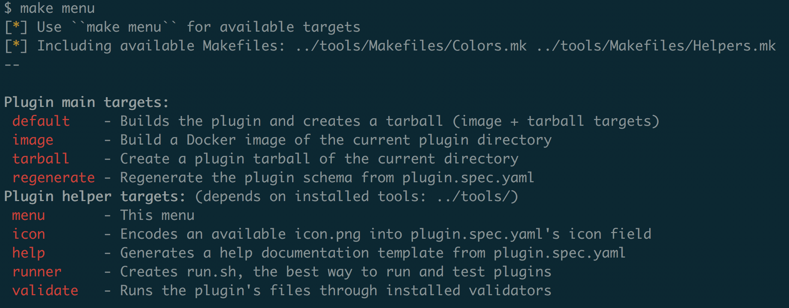

test change

# InsightConnect Plugins

We made a large number of our plugins open-source in order to benefit our customers, partners, and the greater community.

The integrations here include some new, some old, and many that are community supported. These are automatically released to the product marketplace from this repository for convenient orchestration.
The full list of integrations is available on our [Marketplace](https://www.rapid7.com/marketplace/).

For general questions and requests, reach out to us at `IntegrationAlliance@rapid7.com`.

### Table of Contents

1. [Getting Started](#getting-started)
2. [Example](#example)
3. [Plugin Support](#plugin-support)
4. [Contributing](#contributing)

### Getting Started

You can run and develop plugins from the command-line and then orchestrate them via [InsightConnect](https://www.rapid7.com/products/insightconnect/) or legacy Komand.

Plugins are stand-alone REST services that run within Docker containers. You can interact with them over HTTP via the REST service endpoints or stdin/stdout of the running container's process.

See our [developer documentation](https://komand.github.io/python/start.html) to learn how to build a plugin using our Python SDK. To learn more about a specific plugin, see the documentation in every plugin's `help.md` file.

Dependencies:

* [Python 3](https://www.python.org/download/releases/3.0/)
* [Make](https://www.gnu.org/software/make/)
* [Docker Engine](https://www.docker.com)
* [InsightConnect plugin tooling](https://komand.github.io/python/start.html)
* [InsightConnect validators](https://pypi.org/project/insightconnect-integrations-validators/), [pyyaml](https://pyyaml.org/), [js-yaml](https://github.com/nodeca/js-yaml), [jq](https://stedolan.github.io/jq/), [flake8](https://pypi.org/project/flake8/), [mdl](https://github.com/markdownlint/markdownlint) for the helper scripts in `tools/`.

For a quick & easy way to install tooling dependencies, run `update-tools.sh` from the `tools/` directory in this repository!

### Example



Let's build and run a plugin from this repository.

We'll use the Dig plugin as an example. Dig is a command-line network utility for DNS.

```
$ cd dig
$ make
[*] Use ``make menu`` for available targets
[*] Including available Makefiles: ../tools/Makefiles/Colors.mk ../tools/Makefiles/Helpers.mk
--
[*] Building plugin image
docker build --pull -t rapid7/dig:1.0.1 .
Sending build context to Docker daemon  208.9kB
Step 1/14 : FROM komand/python-3-37-slim-plugin:3
2: Pulling from komand/python-3-37-slim-plugin
Digest: sha256:74c67981efc06a27c0e650bc0bc3a681c87bc193869a3316945480c26371f7f4
Status: Image is up to date for komand/python-3-37-slim-plugin:3
...
```

Now, let's create the runner script and then run the plugin:

```
$ make runner
[*] Use ``make menu`` for available targets
[*] Including available Makefiles: ../tools/Makefiles/Colors.mk ../tools/Makefiles/Helpers.mk
--
[*] Creating link to run.sh |

$ ./run.sh -R tests/search_by_domain.json -j

Running: cat tests/forward.json | docker run --rm   -i rapid7/dig:1.0.1  run | grep -- ^\{ | jq -r '.body | try(.log | split("\n") | .[]),.output'
rapid7/Dig:1.0.1. Step name: forward
Executing command /usr/bin/dig google.com A

{
  "status": "NOERROR",
  "fulloutput": "\n; <<>> DiG 9.12.3 <<>> google.com A\n;; global options: +cmd\n;; Got answer:\n;; ->>HEADER<<- opcode: QUERY, status: NOERROR, id: 52959\n;; flags: qr rd ra; QUERY: 1, ANSWER: 1, AUTHORITY: 0, ADDITIONAL: 0\n\n;; QUESTION SECTION:\n;google.com.\t\t\tIN\tA\n\n;; ANSWER SECTION:\ngoogle.com.\t\t162\tIN\tA\t172.217.12.174\n\n;; Query time: 62 msec\n;; SERVER: 192.168.65.1#53(192.168.65.1)\n;; WHEN: Thu Apr 18 17:06:37 UTC 2019\n;; MSG SIZE  rcvd: 44\n\n",
  "question": "google.com",
  "all_answers": [
    "172.217.12.174"
  ],
  "last_answer": "172.217.12.174",
  "answer": "172.217.12.174",
  "nameserver": "192.168.65.1"
}
```

You can also run the plugin container in the background as a REST server:

```
$ ./run.sh -c http
Forwarding to port 10001
Running:  docker run --rm  -d  -p 10001:10001 -i rapid7/dig:1.0.1  http
d719d45e9238d407010e656209f11b30674c2a3dd39225e232685737b111cc2d
```

Let's run the equivalent of the previous example but with a web request:

```
$ curl -d @tests/forward.json http://127.0.0.1:10001/actions/forward
{
  "body": {
    "log": "rapid7/Dig:1.0.1. Step name: forward\nExecuting command /usr/bin/dig google.com A\n",
    "meta": {},
    "output": {
      "all_answers": [
        "172.217.9.78"
      ],
      "answer": "172.217.9.78",
      "fulloutput": "\n; <<>> DiG 9.12.3-P4 <<>> google.com A\n;; global options: +cmd\n;; Got answer:\n;; ->>HEADER<<- opcode: QUERY, status: NOERROR, id: 59113\n;; flags: qr rd ra; QUERY: 1, ANSWER: 1, AUTHORITY: 0, ADDITIONAL: 0\n\n;; QUESTION SECTION:\n;google.com.\t\t\tIN\tA\n\n;; ANSWER SECTION:\ngoogle.com.\t\t162\tIN\tA\t172.217.9.78\n\n;; Query time: 46 msec\n;; SERVER: 192.168.65.1#53(192.168.65.1)\n;; WHEN: Fri Apr 19 16:45:20 UTC 2019\n;; MSG SIZE  rcvd: 44\n\n",
      "last_answer": "172.217.9.78",
      "nameserver": "192.168.65.1",
      "question": "google.com",
      "status": "NOERROR"
    },
    "status": "ok"
  },
  "type": "action_event",
  "version": "v1"
}
```

You can generate sample JSON to use to test your plugin with the runner `run.sh`:

```
$ ./run.sh -c sample
Actions: [forward reverse]
Triggers: []
Sample requires sample name e.g. ``./run.sh -c sample <name>''

$ ./run.sh -c sample forward
Running:  docker run --rm   -i rapid7/dig:1.0.1  sample forward | jq '.'
{
  "body": {
    "action": "forward",
    "input": {
      "query": "A",
      "domain": "",
      "resolver": ""
    },
    "connection": null,
    "meta": {}
  },
  "version": "v1",
  "type": "action_start"
}
```

You can also generate all samples for a plugin with this shorthand: `./run.sh -c samples`

### Plugin Support

The `status` key in a plugin's `plugin.spec.yaml` file indicates which plugins are officially supported by Rapid7 developers (rapid7) and which ones are supported by our ecosystem of external developers or by Rapid7 as best-effort (community).

```
$ grep '^support:' microsoft_teams/plugin.spec.yaml
support: community
```

### Contributing

See our [contributing guide](./CONTRIBUTING.md).
